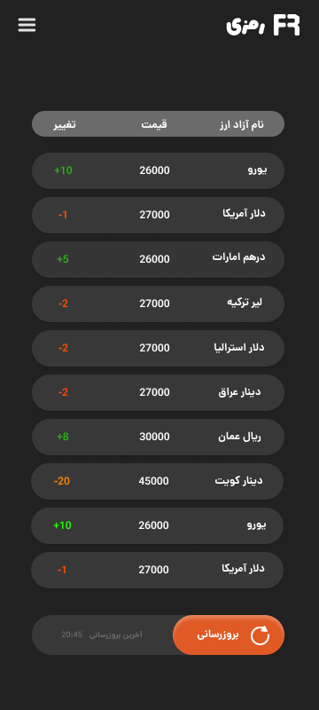

# Ramzi 📱  
A simple Flutter app that displays real-time exchange rates and their daily changes.

## Features 🌟
- 📊 Live currency exchange rates  
- 🔄 Daily price change tracking  
- 🎨 Clean and user-friendly UI  

## Installation 🚀
1. Clone the repository:  
   ```bash
   git clone https://github.com/4itsam/Ramzi.git
## Screenshots 🖼️

<p align="center">
  
  
</p>
